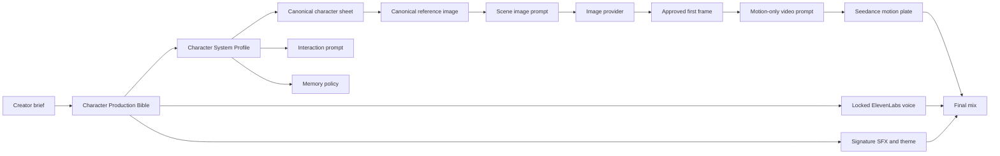

# Chaplin character system

The character is the persistent source of truth. Stories, conversations, stills,
voice lines, and motion plates are views of the character; they do not redefine
the character.

## Wiring



## Canon and memory

Keep three layers separate:

1. **Immutable canon** — name, identity locks, voice identity, core
   contradiction, and moral boundary. Conversation cannot rewrite these.
2. **Approved character state** — canonical reference, approved angles, age
   states, featured voice, theme, SFX, cover, and video. Creators can replace
   these deliberately.
3. **Lived memory** — events, relationships, promises, injuries, and
   possessions learned through stories or interaction. These are retrieved per
   conversation and may never silently change immutable canon.

`CharacterMemoryRecord` defines the runtime record that will later live in a
dedicated Supabase table. It is intentionally separate from
`CharacterProductionBible`, which remains the compact JSONB canon stored on the
character row.

## Character sheet

Every character system carries prompt specifications for:

- front;
- left and right three-quarter;
- left and right profile;
- back;
- full body;
- under-pressure expression.

It also defines younger, canonical, and older states. Aging changes anatomy,
skin, hair, posture, and wardrobe wear while preserving the same four
recognition locks. The generated images become approved references only after
the creator selects them.

`composeCharacterSheetPrompt()` emits one provider-ready sheet frame. The
canonical image is passed separately as `input_references`; it is not
redescribed inside every prompt.

## Prompt assembly

### Identity or sheet image

```text
canonical reference image
  + selected view delta
  + selected age delta
  + expression and wardrobe state
  + neutral camera/light requirements
  + four recognition locks
  + short failure exclusions
```

### Scene image

```text
character canon
  + one visible dramatic beat
  + subject start and expression
  + set
  + framing, angle, lens, and motivated light
  + four recognition locks
```

The API always asks `getCharacterProductionState()` for the featured cover
first. `/api/generate` sends that canonical reference to BytePlus, OpenRouter,
or OpenAI and records the exact source asset in generation metadata.

### Video

```text
approved first frame
  + one subject motion beat
  + one camera movement
  + one secondary motion layer
  + final stillness
  + four practical failure exclusions
```

The video prompt does not repeat face, wardrobe, set, biography, lighting, or
audio. The approved image already defines them. Voice, SFX, and theme are
generated separately and mixed afterward.

### Interaction

`composeCharacterInteractionPrompt()` combines:

- first-person self concept;
- conversation goal and behavioral rules;
- emotional and privacy boundaries;
- locked voice continuity;
- immutable canon;
- only the recent and salient memories retrieved for this interaction.

With no retrieved memory, the character must say it does not remember rather
than inventing a shared history.

## OpenRouter

OpenRouter is implemented behind the existing Image stage and remains off by
default:

1. Add `OPENROUTER_API_KEY` locally and in the deployment environment.
2. Open Super Admin → Pipeline → Image.
3. Select **OpenRouter** and choose a model.
4. Save the pipeline revision.

The provider uses `POST https://openrouter.ai/api/v1/images`. It sends the
canonical image through `input_references`, preserves the shared gallery and
approval workflow, and stores returned prompt/completion/total tokens and
provider-reported USD cost in the generation ledger.

Recommended modes:

- `google/gemini-3.1-flash-image` — Nano Banana 2, main production option;
- `google/gemini-3-pro-image` — Nano Banana Pro, higher-fidelity sheet and hero
  frames;
- `google/gemini-2.5-flash-image` — legacy Nano Banana fallback.

The key alone does not route traffic. BytePlus remains active until Super Admin
explicitly changes the Image provider.

The character studio uses configured image credentials independently of the
active Pipeline Lab provider when creating comparison candidates. A seed or
scene request can generate GPT Image 2, Nano Banana 2, and Dola Seedream 5 from
the same prompt and canonical reference. Each result is saved separately; the
creator explicitly chooses which asset becomes the canonical feed seed or
Seedance first frame.
